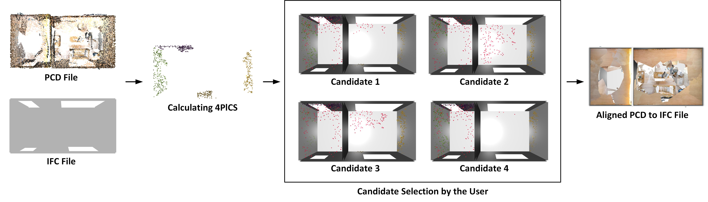

# 4PlCS

This repository contains implementations of the method presented in "4-Plane Congruent Sets for Automatic Registration of As-Is 3D Point Clouds with 3D BIM Models" (https://doi.org/10.1016/j.autcon.2018.01.014) for registrating a dense point cloud (e.g. from laser scanning or photogrammetry) with a 3D BIM model.

More specifically, it includes:
- The original **Matlab** code used to produce the results in the manuscript. This code is provided "raw" and was not commented well. This assumes that the input 3D BIM model is converted in OBJ format. The files are located in `matlab/`. It will also not exactly correspond to the Python codes below.
- A **Jupyter Notebook** that implements the 4PlCS method as well (but not like in the matlab code). This assuming that the input 3D BIM model is in IFC format. The notebook is annotated to explain each step and the parameters involved. The files are located in `notebooks/`.
- A **Python script** `4PlCS.py` that implements the 4PlCS method using the same approach in the Jupyter Notebooabove. 

<ins>IMPORTANTLY</ins>: as noted above, the Jupyter Notebook and Python script implementations were developed independently from the Matlab implementation; they differ in their implementation (e.g. assumptions about the pcd normal vectors)

Any feedback, suggestions or even contributions (e.g. Python library implementation, or structuring of the Matlab code) would be welcome. Don't hesitate to contact me.

## Setup

### Using `venv`

1. Create and activate a virtual environment:
   ```bash
   python -m venv venv
   source venv/bin/activate  # On Windows use `venv\Scripts\activate`
   ```
2. Install dependencies:
   ```bash
   pip install -r requirements.txt
   ```

### Using `conda`

1. Create and activate a conda environment:
   ```bash
   conda create --name 4plcs python=3.9
   conda activate 4plcs
   ```
2. Install dependencies:
   ```bash
   pip install -r requirements.txt
   ```

## Parameters (in the Python implementations)

The Python implementations use a number of parameters whose values naturally impact the quality of the result. We use a global parameter `PCDTYPE` to define the type of point cloud data being worked with. Its default value is `TLS`, for reference to Terrestrial Laser Scanning. We have defined default parameter values for when `PCDTYPE` equals `TLS` and for when ìt does not. You are welcome to extend to different types of sensors/use cases.

In addition to `PCDTYPE`, we also use two additional global parameters:
- `KNOWN_TARGET_LOCATION`: this is set to `True` if the known target point cloud 3D location is known a priori and therefore the parameter `pcd_origin_target` containing the 3D location should be provided. This can be used two for different purposes: (1) when the ground truth is known, so that the difference between calculated and ground truth locations can be returned; (2) when some approximate target location is known, so that we can confidently reject more incompatible congruent sets.
- `APPLY_RANDOM_TRANSFORM`: this is set to `True` if one starts from the ground truth location and wishes to test the performance by applying any transformation to the initial PCD. The random transformation must then be set using the paramters `random_euler_deg` and `random_translation`.

## Running the Python Script

The main script `4PlCS.py` implements the 4PlCS algorithm for automatic registration of a point cloud to an IFC model.

### Usage

You can run the script from the command line, providing paths to the IFC and PCD files as arguments:

```bash
python 4PlCS.py [path/to/your/model.ifc] [path/to/your/pointcloud.ply]
```

If you don't provide the paths as arguments, the script will open file dialogs to let you select the files.

### Process

The script performs the following steps:
1.  Loads the point cloud and the IFC model.
2.  Extracts planar patches from both.
3.  Finds matching 4-plane congruent sets (4PlCS).
4.  Calculates potential transformations.
5.  Displays the candidate alignments 
6.  After you close the visualization window, it prompts you in the console to select the best alignment by number.
7.  Applies the selected transformation and refines it using the ICP algorithm.
8.  Saves the final aligned point cloud in the `output/` directory.


## Acknowledgement
```
@article{BUENO2018120,
author = {Martín Bueno and Frédéric Bosché and Higinio González-Jorge and Joaquín Martínez-Sánchez and Pedro Arias},
title = {4-Plane congruent sets for automatic registration of as-is 3D point clouds with 3D BIM models},
journal = {Automation in Construction},
volume = {89},
pages = {120-134},
year = {2018},
issn = {0926-5805},
doi = {https://doi.org/10.1016/j.autcon.2018.01.014}}
```

<a href="https://github.com/cyberbuildlab/4PlCS/graphs/contributors">
  
</a>

*Made with [contrib.rocks](https://contrib.rocks)*
